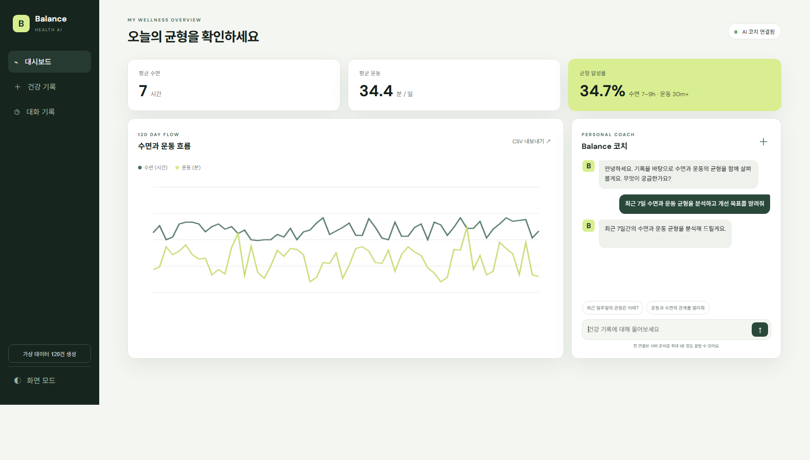
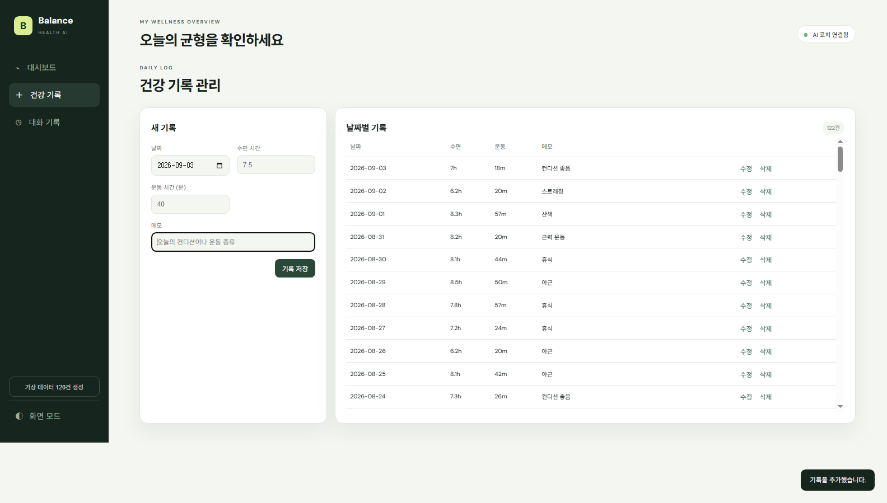
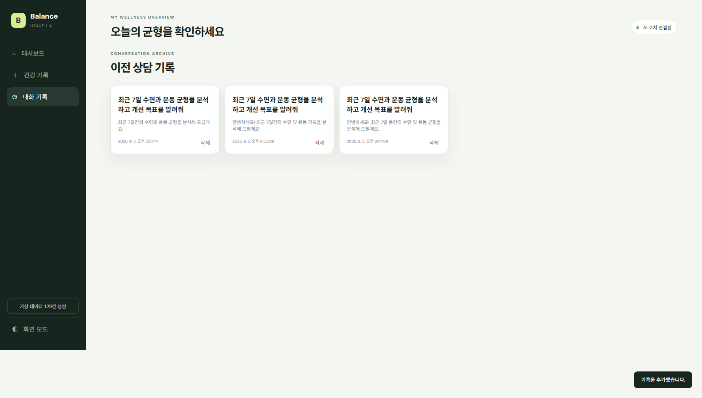

# Balance AI 과제 제출서

## 1. 서비스 개요

Balance AI는 사용자의 날짜별 수면시간과 운동시간을 함께 관리하고, 저장된 시계열 통계를 근거로 개인화된 건강 습관 답변을 제공하는 AI 에이전트입니다. 120일 이상의 가상 데이터로 즉시 시연할 수 있으며 기록 관리, 대화 보관, 시각화와 내보내기를 한 웹 서비스에서 제공합니다.

> AI 답변은 생활 습관 관리 참고용이며 의료 진단을 대신하지 않습니다.

## 2. 제출 URL

- 프론트엔드: https://3-2-son884999-oss-projects.vercel.app
- 백엔드 API: https://balance-ai-api.onrender.com
- Swagger UI: https://balance-ai-api.onrender.com/docs
- GitHub: https://github.com/son884999-oss/3-2

## 3. 요구사항 충족표

| 요구사항 | 구현 내용 | 확인 위치 |
|---|---|---|
| 시계열 데이터 100건 이상 | 고정 난수 시드로 최근 120일 수면·운동 데이터 생성 | `POST /api/data/seed` |
| 기본 통계·최근 추세 | 기간, 개수, 평균·최대·최소·합계, 최근 7일 변화 | `GET /api/data/summary` |
| 데이터 CRUD | 날짜, 수면시간, 운동시간, 메모의 추가·조회·수정·삭제 | `/api/data` |
| 요청 검증 | 수면 0–24시간, 운동 0–1,440분, 미래 날짜·빈 메시지 차단 | `backend/app/models.py` |
| Firestore | `data`, `conversations` 컬렉션과 서비스 계정 인증 | `backend/app/repository.py` |
| AI 컨텍스트 주입 | Firestore 요약을 시스템 지시문에 삽입한 Gemini 호출 | `backend/app/services.py` |
| 대화 기록 | 채팅 자동 저장, 목록·전체 메시지 조회, 삭제, 화면 복원 | `/api/conversations` |
| 로딩 UX | AI 응답 대기 메시지와 Render 콜드스타트 안내 | 채팅 패널 |
| 백엔드 배포 | Render Web Service 및 공개 Swagger | 배포 URL |
| 프론트엔드 배포 | Vercel 정적 배포와 `API_BASE_URL` 빌드 주입 | 배포 URL |
| 보너스 | Canvas 이중 추세 그래프, CSV, 건강 달성률, 다크 모드 | 대시보드 |

## 4. 설계 설명

### 시계열 분석

Firestore에서 날짜순으로 기록을 읽어 수면과 운동 배열로 분리합니다. 전체 기간의 평균·최대·최소와 운동 합계를 계산하고, 최근 7일 평균을 직전 7일 평균과 비교해 증가·감소·유지를 판정합니다. 수면 7–9시간과 운동 30분 이상을 동시에 충족한 날짜 비율을 `healthy_day_rate`로 제공합니다.

### 백엔드 구조

- `routers`: HTTP 경로, 상태 코드와 요청·응답 처리
- `services`: 통계 계산, 시스템 프롬프트, Gemini 호출
- `repository`: Firestore 읽기·쓰기와 직렬화
- `models`: Pydantic 요청 모델과 범위 검증
- `config`: 환경변수, Firebase 초기화, CORS 출처

라우터가 DB 및 AI 세부 구현을 직접 가지지 않도록 역할을 분리해 테스트와 변경 범위를 줄였습니다.

### 컨텍스트 주입

사용자 질문만 AI에 전달하면 개인 데이터를 알 수 없습니다. `/api/chat`은 먼저 Firestore 전체 기록을 요약하고, 기간·통계·최근 추세·핵심 인사이트를 Gemini의 시스템 지시문에 넣습니다. 따라서 답변이 일반론이 아니라 저장된 수치를 근거로 생성됩니다. 최근 대화 12개와 출력 500토큰 제한으로 비용도 제어합니다.

### 배포 보안

Gemini API 키와 Firebase 서비스 계정은 프론트엔드에 노출하지 않고 Render 환경변수와 Secret File로만 관리합니다. Vercel에는 공개 백엔드 주소만 둡니다. CORS는 로컬 주소와 실제 Vercel 도메인만 허용합니다. `.env`, 서비스 계정 JSON, 가상환경은 `.gitignore`에서 제외됩니다.

## 5. 검증 결과

- Python 3.11.16 환경 구성
- 단위 테스트 3개 통과
- Render 루트와 Swagger HTTP 200
- Vercel 공개 페이지 HTTP 200
- Vercel → Render CORS preflight HTTP 200
- Firestore 요약 데이터 120건 이상 조회
- Gemini 실제 답변 생성
- 대화 자동 저장·불러오기·삭제 검증
- 실제 Chrome 자동화로 채팅·CRUD·대화 복원 검증

## 6. 제출 스크린샷

### 데이터 요약 및 AI 채팅

### 데이터 CRUD

### 대화 기록 목록

### 특정 대화 불러오기

## 7. 발표용 한 문장

“수면과 운동 시계열 데이터를 Firestore에 저장하고 통계 요약을 Gemini 시스템 지시문에 주입해, 내 기록을 실제로 이해하는 건강관리 AI 서비스를 구현했습니다.”
